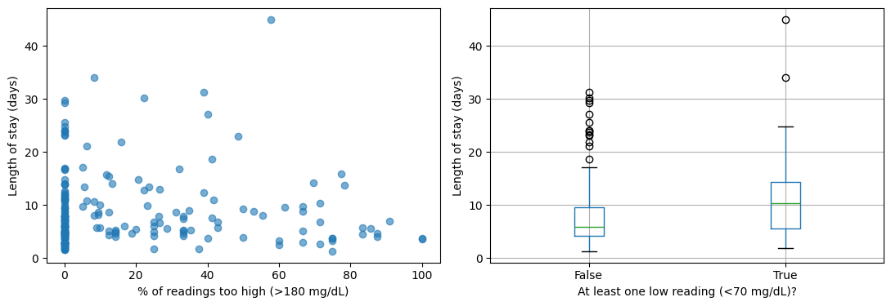

# Inpatient Glucometrics: A Practice Analysis on the MIMIC-IV Demo

A small exploratory project to learn how routinely collected hospital data can be used to measure adverse glycaemia (blood sugar that is too low or too high) in hospital inpatients.

**Author:** Sharmin Kabir (MBBS, MSc Diabetes)
**Status:** Learning project. It is not a research finding and must not be used for clinical decisions.

## Why I did this

Glucometrics is the standard way of analysing inpatient glucose data. I built this project to practise working with real electronic patient record data in Python, and to understand how glucose measures can be linked to hospital outcomes.

## Data

- **MIMIC-IV Clinical Database Demo, version 2.2** (open access, 100 patients, Beth Israel Deaconess Medical Center, USA).
- Johnson A, Bulgarelli L, Pollard T, Horng S, Celi LA, Mark R. PhysioNet, 2023. https://doi.org/10.13026/dp1f-ex47
- Tables used: `labevents`, `d_labitems`, `admissions`.
- Data are not included in this repository. The notebook downloads them from PhysioNet.

## Methods

1. Selected blood glucose results from the laboratory table (2,538 readings kept after removing missing and impossible values, 10 to 1500 mg/dL).
2. Labelled each reading as **low** (< 70 mg/dL, about 3.9 mmol/L) or **high** (> 180 mg/dL, about 10 mmol/L).
3. For each hospital stay, calculated the number of readings, mean glucose, and the percentage of readings that were low and high. Kept stays with at least 3 readings.
4. Calculated length of stay from admission and discharge times.
5. Compared length of stay with glucose measures using medians, Spearman correlation and plots.

## Results

- **199** hospital stays had at least 3 glucose readings.
- **32** of these (16%) had at least one low reading.
- Median length of stay was **5.9 days** without a low reading and **10.3 days** with one.
- Spearman correlation with length of stay: percentage of high readings **0.05**, percentage of low readings **0.17**.

**In simple terms:** stays with a low glucose reading were longer on the whole, but the two groups overlapped a lot, and the percentage of high readings was not clearly linked to length of stay.

## Limitations

- Very small sample (100 patients), so results are unreliable and no statistical conclusions can be drawn.
- **Longer stays produce more glucose readings, so they have more chances to include a low value.** The link between low readings and length of stay may partly reflect this rather than a real effect.
- Sicker patients are tested more often and stay longer (confounding). No adjustment was made.
- Laboratory glucose was used. Bedside finger-prick (point-of-care) glucose, which is common in hospital diabetes care, was not analysed.
- Patients were not filtered for diabetes.
- The data come from a single US hospital and may differ from NHS settings.

## Next steps I would like to take

- Work with the full MIMIC-IV dataset (credentialed access) and include bedside glucose.
- Restrict to patients with diabetes and adjust for age, illness severity and number of readings.
- Standard glucometrics measures per patient-day, such as hypoglycaemia and hyperglycaemia rates.
- Build and validate a simple prediction model for adverse outcomes.

## How to run

1. Open `inpatient-glucometrics-mimic-demo.ipynb` in Google Colab.
2. Run the cells from top to bottom. The first cell downloads the data.

## Note on tools

The code was written with the help of an AI assistant (Claude). I ran the analysis myself, checked the results and wrote the interpretation.
